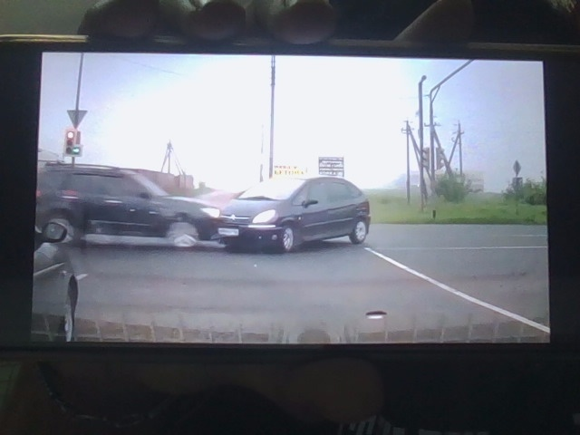
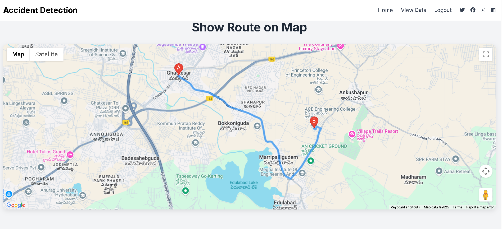

# 🚗 Accident Detection using Flask <a href="https://real-time-accident-detection-using-deep-learning.streamlit.app/">(🔗Link)</a>

This project is a real-time accident detection system developed using **Flask** and a **pretrained deep learning model**. It captures webcam video, detects vehicles, and identifies potential accidents by monitoring overlapping bounding boxes. When a possible accident is detected, a screenshot is captured and saved for analysis.

## 🔍 Features

- Real-time vehicle detection using a pretrained object detection model.
- Accident detection by identifying overlapping bounding boxes (collisions).
- Automatic screenshot capture on accident detection.
- Screenshots are saved in `static/uploads` folder for further review.
- Web-based interface powered by Flask.
- Location tracking using geopy.
- Web-based dashboard for emergency services to track accident reports.

## 🛠️ Tech Stack

- Python
- Flask (Web framework)
- OpenCV (for webcam and image processing)
- Geopy (for Real-Time Location sharing of the Accident)
- Pretrained Deep Learning Model (for vehicle detection)
- HTML/CSS (for frontend)

## 👮‍♂️ User Access: Emergency Services

Login and registration are provided for **emergency response teams** (e.g., ambulance, fire, police). Registered users can:

- View real-time accident detection alerts.
- Access accident history including time, location, and screenshot.
- Use the system as a monitoring dashboard to respond to incidents faster.

## 📁 Folder Structure

project/<br>
│<br>
├── static/<br>
│ └── uploads/ # Accident screenshots stored here<br>
│ └── post_images/ # Images used in HTML,CSS<br>
│<br>
├── templates/ # HTML templates for the Flask frontend<br>
│ └── index.html # Initial HTML file<br>
│ └── admin.html # Camera Access HTML file<br>
│ └── log.html # Login Page<br>
│ └── register.html # Registration Page<br>
│ └── uhome.html # After Login Home page with user Dashboard<br>
│ └── vc.html # Table with all the detected accidents list<br>
│ └── show.html # You can view the location of specific accident<br>
│<br>
├── model/ # Pretrained model<br>
│<br>
├── app.py # Main Flask application<br>
│<br>
├── database.py # Database connection using python<br>
│<br>
├── finaldbcheck.sql # SQL file for creating required tables<br>
│<br>
├── requirements.txt # Required Python libraries<br>
│<br>
└── README.md # Project documentation<br>

## 📸 How It Works
- A webcam captures live video.

- Vehicles are detected using a pretrained TensorFlow model.

- If two detected vehicle bounding boxes overlap (indicating a collision):

- A screenshot is saved to /static/uploads/

- A beep alert is triggered (Windows only)

- The accident is logged with geolocation info

- Emergency service users can review the logs via the web dashboard.


## 🚀 Getting Started

## Prerequisites
- Python 3.7+
- pip

## Installation

1. Clone the repository:
   ```bash
   git clone https://github.com/yourusername/accident-detection-using-flask.git
   cd accident-detection-using-flask

2. Install required packages:
   pip install -r requirements.txt

3. Configure the MySQL Database
    a. Create the database and tables
       Make sure MySQL server is running, then log in to MySQL and run the provided SQL script.
    b. Update database.py with your MySQL credentials
        Open database.py and edit the db_connect() function:
        def db_connect():
        _conn = MySQLdb.connect(host="localhost", user="root",
                        passwd="Your_Password", db="cpro")

4. Run the Flask app:
   python app.py

5. Open your browser and go to:
   http://127.0.0.1:5000/

## Example Output

Live video stream with boxes around detected vehicles.

Collision detected → Screenshot saved in /static/uploads.

## 📸 Screenshots

Example accident detection screenshot saved:


Example location shared with the emergency services:



## 🧠 Future Improvements

- Email/SMS alerts to registered emergency contacts

- Admin panel with analytics and map view

- GPS-based device integration for accuracy

- Improved model using real-time tracking or YOLOv8